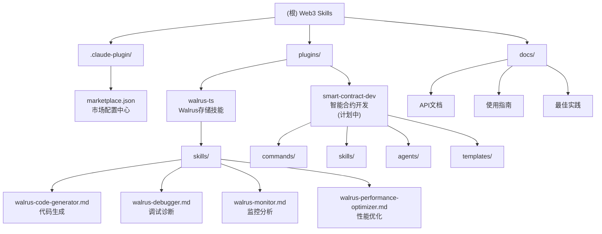

# Web3 Skills - Claude 插件市场

## 项目愿景

Web3 Skills 是一个专业的 Web3 和 AI 编程技能插件市场，致力于收集和提供高质量的区块链开发工具、智能合约开发插件和 AI 辅助编程功能。该项目专注于为 Web3 开发者社区提供实用的开发工具、生产力提升工具和专业化 AI 技能，让 Claude Code 成为 Web3 开发的强大助手。

> **核心定位**：收集网络上或自己制作的 Web3 相关技能，没有特定链或特定功能的限制，打造开放的 Web3 开发生态。

## 架构总览

这是一个基于 Claude Code 插件系统的专业市场项目，采用模块化架构设计，专注于 Web3 和区块链技术栈：



## 核心模块

| 模块路径 | 模块名称 | 类型 | 状态 | 描述 | 主要功能 |
|---------|---------|------|------|------|----------|
| `plugins/walrus-ts` | Walrus TypeScript SDK | 存储工具 | ✅ 已实现 | Walrus去中心化存储AI辅助开发 | 4个AI技能：代码生成、调试、监控、性能优化 |
| `plugins/smart-contract-dev` | 智能合约开发工具 | 开发工具 | 🚧 计划中 | 专业智能合约开发工具集 | 合约模板、安全审查、Gas优化、测试框架 |

## 技术栈

### 核心技术
- **Node.js**: >=18.0.0
- **TypeScript**: ^5.2.2
- **Claude Code**: 插件系统
- **Walrus SDK**: ^0.6.7

### 开发工具
- **Hardhat**: 智能合约开发框架
- **Ethers.js**: 以太坊交互库
- **Jest**: 测试框架
- **ESLint**: 代码检查
- **Prettier**: 代码格式化
- **Husky**: Git钩子管理

### 文档与发布
- **VitePress**: 文档站点
- **Semantic Release**: 自动化版本发布
- **Commitlint**: 提交信息规范

## 快速开始

### 安装市场
```bash
# 添加 Claude Code 市场源
/plugin marketplace add icehugh/web3-skills
```

### 安装插件
```bash
# 安装 Walrus 存储技能插件
/plugin install walrus-ts@web3-skills

# 即将推出：智能合约开发插件
# /plugin install smart-contract-dev@web3-skills
```

### 开发环境设置
```bash
# 克隆项目
git clone https://github.com/icehugh/web3-skills.git
cd web3-skills

# 安装依赖
npm install

# 启动开发环境
npm run dev

# 运行测试
npm test

# 构建项目
npm run build
```

## 插件开发指南

### 创建新插件
1. 在 `plugins/` 目录下创建新插件文件夹
2. 添加必要的子目录结构：
   ```
   plugins/your-plugin/
   ├── commands/      # 自定义命令
   ├── skills/        # AI技能定义
   ├── agents/        # 专业化代理
   ├── templates/     # 代码模板
   ├── CLAUDE.md      # 插件文档
   └── package.json   # 插件配置
   ```
3. 编写插件定义文件（.md 格式）
4. 更新 `.claude-plugin/marketplace.json` 配置

### 插件规范
- 使用中文简体编写所有文档和用户界面文本
- 遵循 Claude Code 插件开发最佳实践
- 提供清晰的命令描述和参数说明
- 包含完整的使用示例和注意事项
- 确保与现有插件生态的兼容性

## 测试策略

### 多层级测试
- **单元测试**: Jest 测试框架，覆盖率要求 80%
- **集成测试**: 智能合约和区块链交互测试
- **安全测试**: 使用 Slither 进行静态安全分析
- **端到端测试**: 完整工作流测试

### 质量保证
- **代码规范**: ESLint + Prettier 自动化格式化
- **提交规范**: Conventional Commits 标准
- **安全审计**: npm audit + 智能合约安全扫描
- **性能监控**: Gas 使用分析和优化建议

## 编码规范

### 通用规范
- **代码风格**: 遵循 ESLint + Prettier 配置
- **命名规范**: camelCase (变量/函数), PascalCase (类/组件)
- **注释标准**: JSDoc 格式，中英文混合注释
- **错误处理**: 统一的错误处理机制和用户友好的错误提示

### 智能合约规范
- **Solidity版本**: ^0.8.19
- **安全标准**: 遵循 OpenZeppelin Security Guidelines
- **Gas优化**: 优先考虑 Gas 效率
- **测试覆盖**: 每个合约 100% 路径覆盖

### TypeScript 规范
- **严格模式**: 启用所有严格类型检查
- **接口设计**: 优先使用接口定义数据结构
- **异步处理**: 统一使用 async/await
- **错误类型**: 定义专门的错误类型和错误码

## AI 使用指引

### 插件开发最佳实践
1. **命令定义**: 使用 YAML front matter 定义命令元数据
2. **技能设计**: 专注于特定领域，提供专业的 AI 能力
3. **代理架构**: 设计专业化的代理处理复杂任务
4. **模板系统**: 提供可复用的代码模板和最佳实践
5. **文档编写**: 包含详细的使用说明和示例代码
6. **错误处理**: 提供友好的错误提示和解决建议

### AI 技能分类
- **代码生成**: 智能合约、TypeScript、测试代码生成
- **代码审查**: 安全检查、性能分析、最佳实践验证
- **调试辅助**: 错误诊断、日志分析、问题定位
- **优化建议**: Gas 优化、代码重构、性能提升
- **测试生成**: 单元测试、集成测试、边界测试

### 质量标准
- **准确性**: AI 生成内容的准确性和可靠性
- **实用性**: 解决实际开发问题的能力
- **可扩展性**: 支持多种框架和使用场景
- **安全性**: 遵循安全最佳实践，避免安全漏洞

## 项目维护

### 版本管理
- **语义化版本**: 遵循 SemVer 规范
- **自动化发布**: Semantic Release + GitHub Actions
- **变更日志**: 自动生成 CHANGELOG.md
- **标签管理**: 自动创建 Git 标签和 Release

### 社区建设
- **贡献指南**: 详细的 CONTRIBUTING.md 文档
- **问题模板**: GitHub Issues 标准化模板
- **PR 流程**: 代码审查和自动化检查
- **文档维护**: 持续更新使用指南和最佳实践

### 持续改进
- **用户反馈**: 收集和处理用户建议
- **性能监控**: 插件性能和使用情况监控
- **技术更新**: 跟进 Web3 和 AI 技术发展
- **生态扩展**: 不断增加新的插件和功能

## 变更记录 (Changelog)

### 2025-11-11 - 项目重构完成 v2.0.0
- 🚀 重新设计项目架构和文档结构
- ✨ 完成 Walrus TS 插件的 4 个 AI 技能开发
- 📋 智能合约开发插件规划完成
- 📊 项目成熟度：8.0/10.0
- 🔧 完善开发工具链和 CI/CD 流程

### 2025-11-11 - 移除测试助手技能
- 🗑️ 移除 walrus-test-helper.md 技能文件
- 📝 更新相关文档，移除测试辅助功能描述

### 未来规划
- **Q4 2025**: 完成智能合约开发插件
- **Q1 2026**: 添加 DeFi 协议分析插件
- **Q2 2026**: 集成更多区块链网络支持
- **Q3 2026**: 开发 Web3 安全审计工具

---

## 相关链接

- **GitHub 仓库**: https://github.com/icehugh/web3-skills
- **问题反馈**: https://github.com/icehugh/web3-skills/issues
- **文档站点**: https://web3-skills.docs.dev
- **插件市场**: https://claude.ai/marketplace/web3-skills

---

*最后更新时间：2025-11-11 22:41:37*
*项目版本：2.0.0*
*维护者：icehugh*